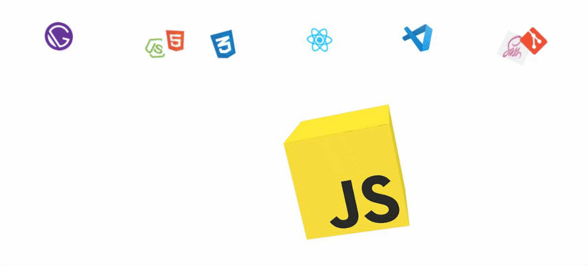

# Frontend-JS-Lessons
My_Frontend || JavaScript || 10 - Lessons

## All Lessons
 - [Lesson - 1](https://github.com/tolqinov-o/Frontend-JS-Lessons/tree/main/lesson-1)
 - [Lesson - 2](https://github.com/tolqinov-o/Frontend-JS-Lessons/tree/main/lesson-2)
 - [Lesson - 3](https://github.com/tolqinov-o/Frontend-JS-Lessons/tree/main/lesson-3)
 - [Lesson - 4](https://github.com/tolqinov-o/Frontend-JS-Lessons/tree/main/lesson-4)
 - [Lesson - 5](https://github.com/tolqinov-o/Frontend-JS-Lessons/tree/main/lesson-5)

## Tech Stack

- HTML
- CSS
- JS

## Authors

- [T.Oqilbek](https://www.github.com/tolqinov-o)